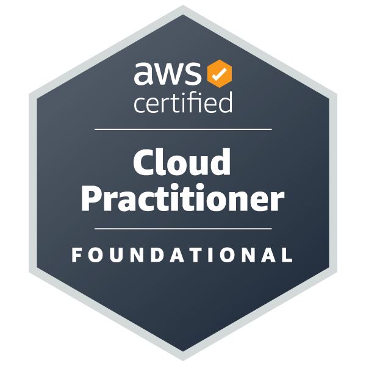

# Hi, I'm Dinesh 👋

I'm a Software Engineer with 9 years of experience building web applications,
backend systems, and cloud-native solutions.

### 🛠️ Tech Stack

- **Languages:** JavaScript, TypeScript, Python, Go
- **Frontend:** React, Next.js
- **Backend:** Node.js, NestJS, Django
- **Databases:** PostgreSQL, MongoDB, Redis
- **Cloud & DevOps:** AWS, Docker, Kubernetes
- **AI/ML:** LLMs, RAG, LangChain

### 📜 Certifications

### ✍️ Writing

I write about software engineering, cloud, DevOps, and technology on Medium.

- [Medium](https://medium.com/@dineshmurali)

### 📫 Connect

- [LinkedIn](www.linkedin.com/in/dinesh-murali-81856512b)
- [Medium](https://medium.com/@dineshmurali)

